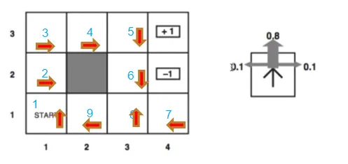

# Reinforcement Learning - Grid World Policy & Value Iteration

This repository contains implementations of **Policy Iteration** and **Value Iteration** algorithms applied to a classic **4x3 stochastic grid world** environment, a standard problem in Reinforcement Learning (RL).

---

## 📁 Repository Structure

- `RL_Assignment_reduced.pdf`  
  Contains the original assignment instructions and environment specifications.

- `policy_iteration.py`  
  Implementation of the **Policy Iteration** algorithm:
  - Iteratively evaluates a fixed policy and improves it.
  - Includes clear policy evaluation and policy improvement steps.
  - Converges to an optimal policy and utility function.

- `value_iteration.py`  
  Implementation of the **Value Iteration** algorithm:
  - Uses the Bellman optimality update to compute utility values.
  - Extracts the optimal policy after value function convergence.
  - Simpler loop with integrated action optimization.

---

## 📦 Problem Overview



An agent navigates a 4x3 grid environment with:
- **Stochastic movements** (80% intended, 10% left, 10% right).
- **Terminal states** at `(4, 3)` with reward `+1` and `(4, 2)` with reward `-1`.
- A **wall** at `(2, 2)` (impassable).
- Step cost of `-0.04` for non-terminal moves.

The goal is to compute:
- The **utility values** of each state.
- The **optimal policy** that maximizes expected future rewards.

---

## 🧠 Algorithms Used

### 🔁 Policy Iteration
1. Initialize a random policy.
2. **Policy Evaluation**: Calculate utilities assuming the current policy.
3. **Policy Improvement**: Update policy based on max expected utility.
4. Repeat until the policy stabilizes.

### 💡 Value Iteration
1. Initialize utility values.
2. Iteratively apply the **Bellman optimality equation**
3. Extract policy from the final utility values.

---

## ▶️ How to Run

```bash
python policy_iteration.py
python value_iteration.py
```

Each script will print:
- Utility values after each iteration.
- The evolving and final optimal policy.

## Output Format
- Utility grid: shows the estimated utility of each state.
- Policy grid: uses arrows (↑ ↓ ← →) to show optimal actions per state.
- Walls are displayed as XX, terminal states show their reward values.